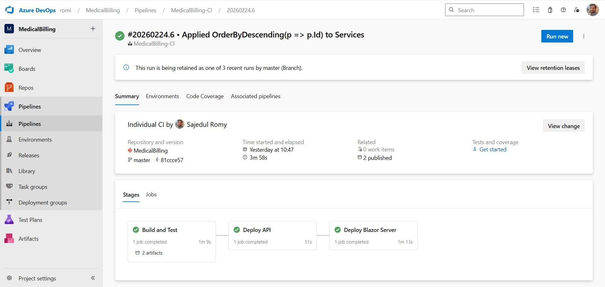
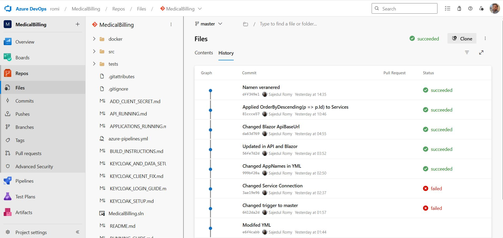
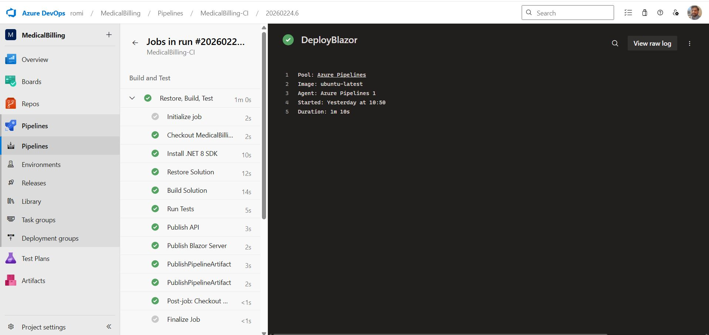
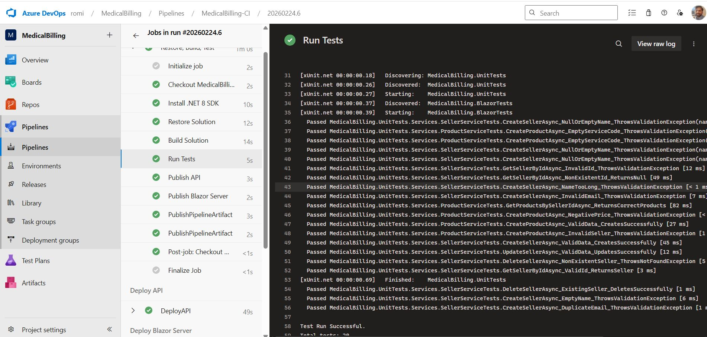

# Medical Billing Application - Quick Start Guide

## Prerequisites

- Docker Desktop installed
- .NET 8 SDK (for local development)
- SQL Server (local) or Docker

## CI/CD Pipeline & Quality Gates

This project uses **Azure DevOps** for continuous integration and deployment:

- Multi-stage pipeline: Build → Test → Deploy
- Automated unit/integration tests for backend & frontend
- Commit-triggered builds with status checks

### Pipeline Overview



### Successful Build & Commit Status



_(Note: filename seems to have typo – probably `Azure-repo-commit-pipeline-passed.jpg` – fix if needed)_

### Deployment Success (CD Stage)



### Tests Passed (Backend + Frontend)



## Option 1: Run with Docker (Recommended)

### Step 1: Build and Start All Services

```powershell
cd c:\Medical-Billing
docker-compose -f docker/docker-compose.yml up --build
```

This will start:

- SQL Server (port 1433)
- Keycloak (port 8080)
- API (port 5001)
- Blazor Server (port 5000)

### Step 2: Configure Keycloak

1. Open http://localhost:8080
2. Login with admin/admin
3. Create realm: `MedicalBilling`
4. Create client: `medical-billing-api`
5. Create roles: `Admin`, `Seller`, `User`
6. Create users with roles

### Step 3: Access Application

- Blazor UI: http://localhost:5000
- API Swagger: http://localhost:5001/swagger
- Keycloak: http://localhost:8080

## Option 2: Run Locally

### Step 1: Start SQL Server

```powershell
# Using Docker
docker run -e "ACCEPT_EULA=Y" -e "SA_PASSWORD=YourStrong@Passw0rd" -p 1433:1433 -d mcr.microsoft.com/mssql/server:2022-latest
```

### Step 2: Update Connection String

Edit `src/MedicalBilling.API/appsettings.json`:

```json
{
  "ConnectionStrings": {
    "DefaultConnection": "Server=localhost;Database=MedicalBillingDb;User Id=sa;Password=YourStrong@Passw0rd;TrustServerCertificate=True"
  }
}
```

### Step 3: Run Migrations

```powershell
cd c:\Medical-Billing
dotnet ef database update --project src/MedicalBilling.Infrastructure --startup-project src/MedicalBilling.API
```

### Step 4: Run API

```powershell
cd src/MedicalBilling.API
dotnet run
```

API will be available at: https://localhost:5001

### Step 5: Run Blazor Server

```powershell
cd src/MedicalBilling.BlazorServer
dotnet run
```

Blazor will be available at: http://localhost:5000

## Testing

### Run All Tests

```powershell
cd c:\Medical-Billing
dotnet test
```

### Run Specific Test Project

```powershell
# Unit tests
dotnet test tests/MedicalBilling.UnitTests

# Blazor tests
dotnet test tests/MedicalBilling.BlazorTests
```

## Azure Deployment

See [azure-deployment-guide.md](docs/azure-deployment-guide.md) for detailed Azure deployment instructions.

## Default Credentials

**Keycloak Admin:**

- Username: admin
- Password: admin

**Application Users (after Keycloak setup):**

- Admin: admin/admin (full access)
- Seller: seller1/seller123
- User: user1/user123

## Troubleshooting

### SQL Server Connection Issues

```powershell
# Check if SQL Server is running
docker ps | grep sqlserver

# View SQL Server logs
docker logs medicalbilling-sqlserver
```

### API Not Starting

```powershell
# Check API logs
docker logs medicalbilling-api

# Verify database connection
dotnet ef database update --project src/MedicalBilling.Infrastructure --startup-project src/MedicalBilling.API
```

### Keycloak Issues

```powershell
# Restart Keycloak
docker restart medicalbilling-keycloak

# View Keycloak logs
docker logs medicalbilling-keycloak
```

## Development Workflow

1. Make code changes
2. Run tests: `dotnet test`
3. Build solution: `dotnet build`
4. Run locally or rebuild Docker: `docker-compose up --build`

## Production Deployment

For production deployment to Azure, follow the comprehensive guide in:

- [azure-deployment-guide.md](docs/azure-deployment-guide.md)

## Support

For issues or questions, refer to:

- [Implementation Plan](docs/implementation_plan.md)
- [Database Architecture](docs/database-architecture.md)
- [Walkthrough](docs/walkthrough.md)
